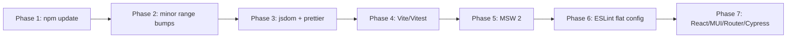

# Dependency Update Plan

Plan for bringing outdated dependencies up to date, ordered from easiest to hardest.

**Generated:** June 2026  
**Baseline:** `npm outdated` against current `package.json` / `package-lock.json`

## Current Snapshot

| Area | Installed | Latest | Gap |
|------|-----------|--------|-----|
| Build/test | Vite 4, Vitest 0.31 | Vite 8, Vitest 4 | Large, coupled |
| React stack | React 18.2 | React 19 | Major |
| UI | MUI 5.13 | MUI 9 | Major |
| Lint/format | ESLint 8, Prettier 2 | ESLint 10, Prettier 3 | Major |
| Mocking | MSW 1.2 (`rest` API) | MSW 2 | API rewrite |
| E2E | Cypress 12 | Cypress 15 | Major |

**Note:** Project targets **Node 24** (`.nvmrc` and CI). Use `nvm use` before running tests locally.

## Verification Checklist

After each phase:

```bash
npm run build
npm test
npm run lint
npm run test:cypress
```

---

## Phase 1 — Easiest: `npm update` (no `package.json` edits)

Run one command to pull everything to the **Wanted** column (still within existing `^` ranges):

```bash
npm update
```

This updates ~25 packages with minimal risk:

- **Runtime:** `@emotion/*`, `@fontsource/roboto`, `@mui/*` (5.x), `axios`, `react`/`react-dom` (18.3), `react-router-dom` (6.30)
- **Dev:** `@testing-library/*` (except cypress helper), `@types/react*`, ESLint 8.x plugins, `cypress` 12.17, `msw` 1.3, `vite` 4.5

**Effort:** ~15 minutes  
**Risk:** Low  
**PR suggestion:** `chore: update dependencies within semver ranges (Phase 1)`

---

## Phase 2 — Still Easy: Bump Ranges Stuck Below Latest Minor

These won't move with `npm update` because semver ranges cap them:

| Package | Current range | Bump to | Why it's easy |
|---------|---------------|---------|---------------|
| `eslint-plugin-react-refresh` | `^0.3.4` | `^0.4.26` | Latest compatible with ESLint 8 (`0.5.x` needs ESLint 9 — defer to Phase 6) |
| `@testing-library/cypress` | `^9.0.0` | `^10.1.3` | Test helper only |
| `gh-pages` | `^5.0.0` | `^6.3.0` | Deploy script unchanged (`gh-pages -d dist`) |

**Effort:** ~30 minutes  
**Risk:** Low

---

## Phase 3 — Medium: Test Environment Fixes

| Package | From → To | Notes |
|---------|-----------|-------|
| `jsdom` | 22 → 29 | **29.1.1** with Vitest 4 + Node 24 (fails on Node 18 with `ERR_REQUIRE_ESM`) |
| `prettier` | 2 → 3 | Run `npx prettier --write .` once; also bump `eslint-plugin-prettier` to ^5 |

Do these **before** the Vite/Vitest jump so there is a stable test baseline.

**Effort:** ~1 hour  
**Risk:** Medium (formatting churn, test env changes)

---

## Phase 4 — Medium-Hard: Vite + Vitest (do together)

These must move as a unit:

```
vite ^4  →  ^5  →  ^6  (stop and test each step)
vitest ^0.31  →  match vite major
@vitejs/plugin-react ^4  →  match vite major
```

Suggested path (incremental, not straight to 8):

1. Vite 5 + Vitest 1.x + plugin-react 4
2. Vite 6 + Vitest 2.x + plugin-react 4
3. Vite 7/8 + Vitest 3/4 + plugin-react 6 (only after earlier steps pass)

`vite.config.js` is simple today, so breakage should be limited, but Vitest 0.31 → 1+ may change globals/setup behavior.

**Status (implemented):** Vite 6 + Vitest 4 + `@vitejs/plugin-react` 4.7. Skipped Vite 5/7/8 intermediate steps — this combo passes build, lint, and tests on Node 24.

- `jsdom` **29.1.1** (requires Node 24; upgraded after `.nvmrc`/CI bump)
- `eslint-plugin-vitest@0.5` breaks legacy `.eslintrc.cjs` — left at 0.2.8 until Phase 6 (ESLint flat config)
- `vite.config.js` now imports `defineConfig` from `vitest/config`

**Effort:** 2–4 hours  
**Risk:** Medium-high

---

## Phase 5 — Medium-Hard: MSW 1 → 2

Mocks in `src/mocks/handlers.js` use the old `rest` API:

```js
import { rest } from "msw";

export const handlers = [
  rest.get(/\/scrape-puzzle-url$/, mockScrapePuzzleUrlHandler),
  // ...
];
```

MSW 2 replaces `rest` with `http` and changes handler signatures. Touch:

- `src/mocks/handlers.js`
- `src/mocks/server.js` (may need `setupServer` → new import path)
- `src/setupFiles.js` (if it references MSW lifecycle)

**Effort:** ~1–2 hours  
**Risk:** Medium (isolated to tests)

---

## Phase 6 — Hard: ESLint 8 → 9/10

ESLint 9+ expects **flat config** (`eslint.config.js`). `.eslintrc.cjs` would need a full migration:

- `eslint`, `eslint-config-prettier`, `eslint-plugin-prettier`
- `eslint-plugin-react-hooks` 7.x (React 19 rules)
- `eslint-plugin-vitest`, `eslint-plugin-cypress` 6.x

**Effort:** 2–3 hours  
**Risk:** High (config rewrite, rule changes)

---

## Phase 7 — Hard: Framework Majors (save for last)

| Upgrade | Impact |
|---------|--------|
| React 18 → 19 | `@types/react` 19, possible test/library updates |
| react-router 6 → 7 | Route APIs, loader patterns |
| MUI 5 → 9 | Large UI breaking changes (or stop at MUI 6 first) |
| Cypress 12 → 15 | Config, browser support, CI container update |

Also update CI while here:

- ~~`.github/workflows/ci.yml`: Node 18.16 → 20 LTS~~ **Done:** Node 24, `actions/checkout@v4`, `setup-node@v4`, `cypress/browsers:24.14.0`

**Effort:** Days, not hours  
**Risk:** High

---

## Recommended Order



## Progress Tracking

| Phase | Status | PR / notes |
|-------|--------|------------|
| 1 — `npm update` | Done | `package-lock.json` only; build + lint pass; MUI 5.18 Select uses `combobox` role — fixed in `HomePage.test.jsx` |
| 2 — Minor range bumps | Done | `eslint-plugin-react-refresh` capped at `0.4.26` (ESLint 8); `@testing-library/cypress` 10.1.3; `gh-pages` 6.3.0 |
| 3 — jsdom + prettier | Done | prettier 3.8 + eslint-plugin-prettier 5.5; jsdom now 29.1.1 (see Node 24 bump) |
| 4 — Vite/Vitest | Done | Vite 6.4 + Vitest 4.1 + plugin-react 4.7 + jsdom 29; Node 24 in `.nvmrc`/CI; `vitest/config` in vite.config.js |
| 5 — MSW 2 | Not started | |
| 6 — ESLint flat config | Not started | |
| 7 — Framework majors | Not started | |
